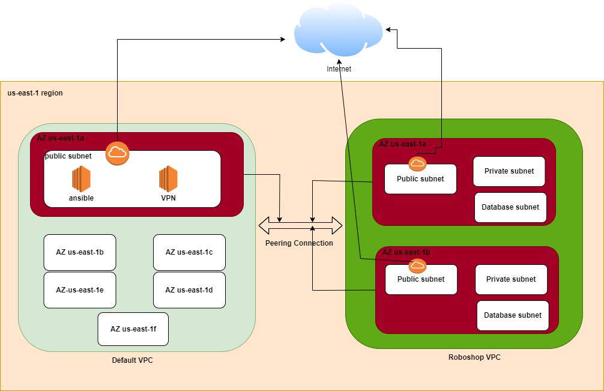

### Roboshop VPC

* **Created a VPC with two public subnets, two private subnets, two database subnets in two AZ(us-east-1a, us-east-1b).**  
* **Created a Internet gateway and attached it to VPC.**  
* **Created three route tables, public_route_tb, private_route_tb and database_route_tb.**  
* **Attached route tables to subnets.**  
* **Created Elastic Ip for NAT gateway.**  
* **Created NAT Gateway in one of the public subnet by attaching EIP.**  
* **Added routes in the respective route tables.**  
* **Created peering connection with auto approve as both default VPC and roboshop VPC are in one region and one account.**  

### Default VPC

* **Created a EC2 instance(VPN) in one of the public subnet.**  
* **we can connect to roboshop private subnet and database subnet resources by connectiong to VPN from outside the network.**  
* **Created a ansible server in one of the public subnet, which connect to roboshop VPC resources inorder to configure those.**  This is ansible push mechanism  

### VPC Peering combinations
* one account - one region
* one account - different region
* different account - one/different region
